# Parallel computing architectures

## Flynn's taxonomy

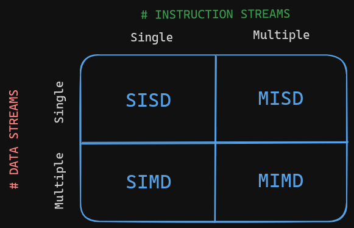

- **`SISD`**: Single Instruction, Single Data
  - Describes the organization of a conventional uniprocessor machine
  - 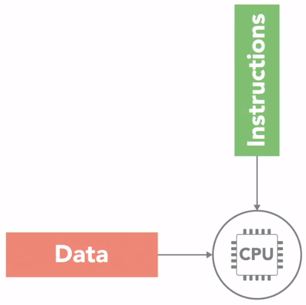
- **`SIMD`**: Single Instruction, Multiple Data
  - Description: A single instruction is broadcast to multiple processing elements, which simultaneously perform the same operation on different data.
  - Example: GPU
  - 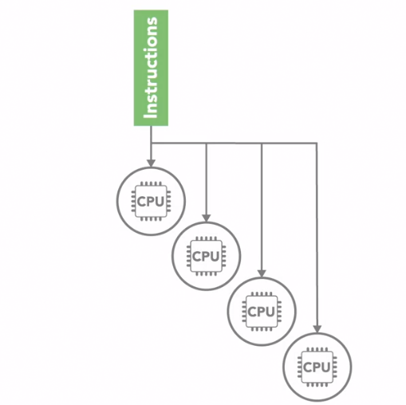
- **`MISD`**: Multiple Instruction, Single Data
  - Description: Multiple processing elements simultaneously execute different operations on the same data.
  - Example: Fault-tolerant systems
  - 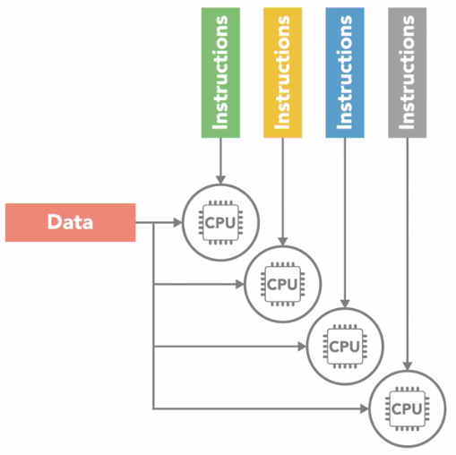
- **`MIMD`**: Multiple Instruction, Multiple Data
  - Description: Multiple processing elements simultaneously execute different operations on different data.
  - Example: Multicore CPU
  - This is subdivided into two categories:
    - **`SPMD`**: Single Program, Multiple Data
      - All processors execute the same program, but each processor has its own data.
      - It's diferent from SIMD because each processor can execute different instructions at the same time.
    - **`MPMD`**: Multiple Program, Multiple Data
      - Each processor may execute a different program, and each processor has its own data.
  - 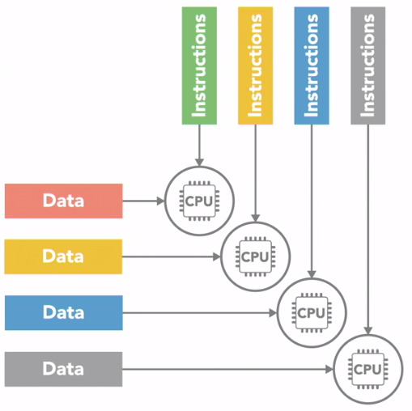

## Shared memory vs Distributed memory

- **`Shared memory`**: All processors have access to a global memory.
  - **`Unifor memory access (UMA)`**: All processors have the same access time to the memory.
    - 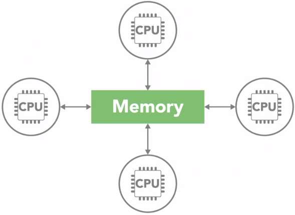
    - Some types of UMA:
      - **`Symmetric multiprocessor (SMP)`**: All processors are identical and share the same memory.
        - 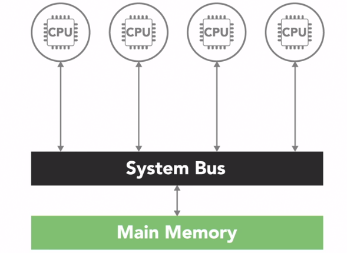
  - **`Non-uniform memory access (NUMA)`**: Processors have different access times to the memory.
    - Its a multiple SMP systems together.
    - Access non-uniform because the access time to the memory is different for each processor.
    - 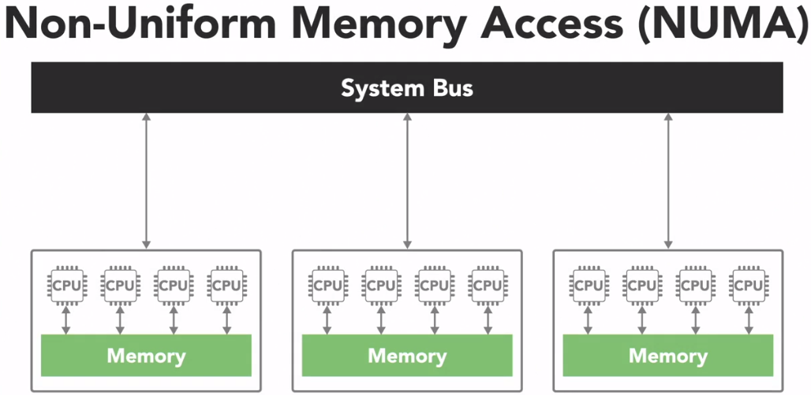

- **`Distributed memory`**: Each processor has its own local memory, and processors can access each other's memory.
  - Description: Each processor has its own local memory, and processors can access each other's memory.
  - Each processor operates independently and has its own memory. That change is not automatically reflected in the memory of other processors.
  - The advantage of this architecture is that it is scalable, since the memory of each processor is independent of the others.
  - 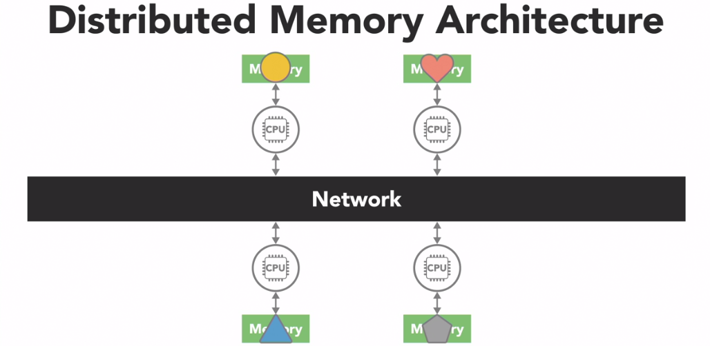

> For this course we'll stick a simple shared memory in a SMP architecture.

# Questions

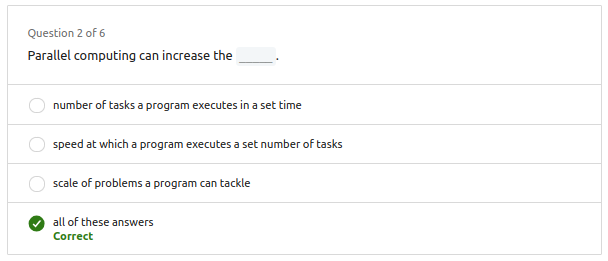

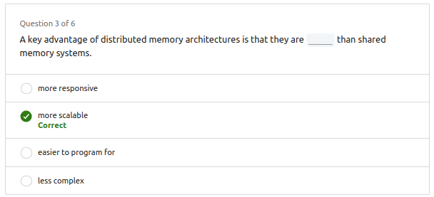

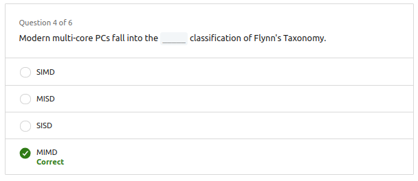

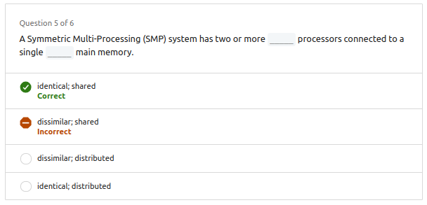

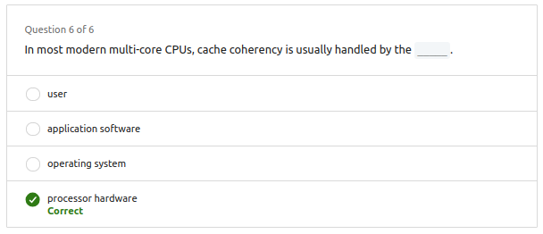