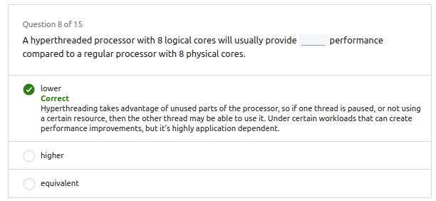
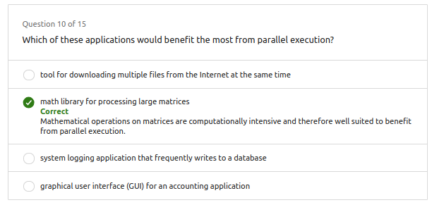

# 1. Thread vs Process

## 1.1. Process

- Include: Code, Data, Stack, Heap
- Independent of the instance of a program running
- Separate address space (memory)
- Manage by OS
---
- Incluye: Código, Datos, Pila, Montón
- Independiente de la instancia de un programa en ejecución
- Espacio de direcciones separado (memoria)
- Administrado por el sistema operativo

## 1.2. Thread

- Like tiny process.
- Independent path of execution
- Subsets of a process
- Operating system schedules threads for execution
---
- Como un pequeño proceso.
- Ruta de ejecución independiente
- Subconjuntos de un proceso
- El sistema operativo programa los hilos para su ejecución

## 1.3. How is her relationship?

## 1.4. Inter-Process Communication (IPC)

- Processes can communicate with each other using these mechanisms:
    - Sockets and Pipes
    - Shared Memory
    - Remote Procedure Calls (RPC)

---
- Los procesos pueden comunicarse entre sí utilizando estos mecanismos:
    - Sockets y tuberías
    - Memoria compartida
    - Llamadas a procedimientos remotos (RPC)

## 1.5. Thread vs Processes

- Threads are used for small tasks, whereas processes are used for more ‘heavyweight’ tasks – basically the execution of applications.
- Threads are "lightweight" - require less overhead to create and terminate.
- Operating system switches between threads faster than processes.

---

- Los hilos se utilizan para tareas pequeñas, mientras que los procesos se utilizan para tareas más "pesadas", básicamente la ejecución de aplicaciones.
- Los hilos son "livianos": requieren menos gastos generales para crear y terminar.
- El sistema operativo cambia entre hilos más rápido que los procesos.

## 1.6. Thread vs Processes on C++

[Code here](<Ex_Files_C_Plus_Plus_Parallel_Prog/Exercise Files/CH02/02_02/begin/thread_process_demo.cpp>)

# 2. Concurrent vs Parallel

|Current|Parallelism|
|---|---|
|Two or more tasks can start, run, and complete in overlapping time periods.|Two or more tasks are executed simultaneously.|
|Program Structure: Based on the concept of multitasking.|Program Structure: Based on the concept of multiprocessor.|
|DEALING with multiple things at once.|DOING multiple things at once.|

---
|Concurrente|Paralelismo|
|---|---|
|Dos o más tareas pueden comenzar, ejecutarse y completarse en períodos de tiempo superpuestos.|Dos o más tareas se ejecutan simultáneamente.|
|Estructura del programa: basada en el concepto de multitarea.|Estructura del programa: basada en el concepto de multiprocesador.|
|LIDIANDO con varias cosas a la vez.|HACIENDO varias cosas a la vez.|

# 3. Execution schedule

- The order in which threads are executed by the CPU is called the **execution schedule**.
- **Threads and processes need to be scheduled** to execute on a limited number of processors, and the operating system's scheduler determines the order in which they run.
- The scheduler cycles through **ready processes, allowing them to execute on the processor**, and may switch to another process based on various conditions.
- If a process finishes or gets blocked, the scheduler assigns another process to run. A **context switch** occurs when the scheduler swaps out one process for another.
- During a **context switch, the operating system saves the state** of the current process and loads the state of the new process.
- **Context switches are not instantaneous**, and the scheduler needs a strategy for how frequently it switches between processes. Different operating systems implement various **scheduling algorithms**.
  - **First come, first served (FCFS)**
  - **Shortest job first (SJF)**
  - **Priority scheduling**
  - **Shortest remaining time**
  - **Round robin**
  - **Multiple level queues**
- GOALS:
  - Maximize troughput
  - Maximixe fairness
  - Minimize wait time
  - Minimize latency

---
- El orden en que los hilos son ejecutados por la CPU se llama el **plan de ejecución**.
- **Los hilos y procesos deben ser programados** para ejecutarse en un número limitado de procesadores, y el planificador del sistema operativo determina el orden en que se ejecutan.
- El planificador recorre los **procesos listos, permitiéndoles ejecutarse en el procesador**, y puede cambiar a otro proceso según diversas condiciones.
- Si un proceso termina o se bloquea, el planificador asigna otro proceso para ejecutarse. Ocurre un **cambio de contexto** cuando el planificador reemplaza un proceso por otro.
- Durante un **cambio de contexto, el sistema operativo guarda el estado** del proceso actual y carga el estado del nuevo proceso.
- **Los cambios de contexto no son instantáneos**, y el planificador necesita una estrategia para determinar con qué frecuencia cambia entre procesos. Diferentes sistemas operativos implementan diversos **algoritmos de programación**.
  - **Primero en llegar, primero en ser servido (FCFS)**
  - **El trabajo más corto primero (SJF)**
  - **Programación por prioridad**
  - **Tiempo restante más corto**
  - **Round robin**
  - **Colas de múltiples niveles**
- Metas:
  - Maximizar el rendimiento
  - Maximizar la equidad
  - Minimizar el tiempo de espera
  - Minimizar la latencia

# 4. Execution on C++

[Code here](<Ex_Files_C_Plus_Plus_Parallel_Prog/Exercise Files/CH02/02_05/begin/execution_scheduling_demo.cpp>)

# 5. Thread life cycle

- **Thread Lifecycle:**
  - When a new process or program begins running, it starts with just one thread, the main thread.
  - The main thread can spawn additional threads (child threads) to perform tasks independently.
  - Threads can further spawn their own children if needed.
  - Threads finish execution, notify their parent, and terminate, with the main thread usually being the last.
  - The lifecycle of a thread involves four states: **new, runnable, blocked, and terminated.**
  - 

- **Thread Execution:**
  - Creating a new thread involves assigning it a function, the code it will execute.
  - Some programming languages require explicit thread start after creation.
  - Threads in the **runnable state** can be scheduled by the operating system to execute.
  - Threads may get swapped out with others through context switches, allowing independent execution.

- **Waiting and Blocking:**
  - Threads may need to wait for events, like external inputs, and go into a **blocked state.**
  - While blocked, a thread doesn't use CPU resources.
  - The operating system returns the thread to the runnable state after the event occurs.

- **Joining Threads:**
  - Threads may wait for their children to finish using the **join method.**
  - Joining a thread causes it to enter a blocked state until the joined thread completes.
  - The processor is freed up for other threads during the waiting period.

- **Thread Termination:**
  - Threads enter the **terminated state** when they complete execution or are abnormally aborted.
  - Parent threads can be notified by child threads when they finish execution.

- **Example Scenario:**
  - Main thread delegates a task to a child thread (Olivia slicing sausages).
  - Child thread goes through states (new, runnable) and is blocked while waiting for the sausage to thaw.
  - Main thread may wait for the child thread to finish using the join method.
  - After child thread finishes, it notifies the main thread, which can then proceed.
  - The main thread eventually finishes execution and enters the terminated state.

- **Note:**
  - Different programming languages may have variations in state names, but generally, the four phases are present.

---

- **Ciclo de vida del hilo:**
  - Cuando un nuevo proceso o programa comienza a ejecutarse, comienza con un solo hilo, el hilo principal.
  - El hilo principal puede generar hilos adicionales (hilos secundarios) para realizar tareas de manera independiente.
  - Los hilos pueden generar sus propios hijos si es necesario.
  - Los hilos finalizan la ejecución, notifican a su padre y terminan, siendo el hilo principal generalmente el último.
  - El ciclo de vida de un hilo involucra cuatro estados: **nuevo, ejecutable, bloqueado y terminado.**

- **Ejecución del hilo:**
  - Crear un nuevo hilo implica asignarle una función, el código que ejecutará.
  - Algunos lenguajes de programación requieren un inicio explícito del hilo después de la creación.
  - Los hilos en el estado **ejecutable** pueden ser programados por el sistema operativo para ejecutarse.
  - Los hilos pueden ser intercambiados con otros a través de cambios de contexto, permitiendo la ejecución independiente.

- **Espera y Bloqueo:**
  - Los hilos pueden esperar eventos, como entradas externas, y entrar en un estado **bloqueado.**
  - Mientras está bloqueado, un hilo no utiliza recursos de la CPU.
  - El sistema operativo devuelve el hilo al estado ejecutable después de que ocurre el evento.

- **Unión de Hilos:**
  - Los hilos pueden esperar a que sus hijos terminen usando el **método join.**
  - Unirse a un hilo hace que entre en un estado bloqueado hasta que el hilo unido complete su ejecución.
  - El procesador queda libre para otros hilos durante el período de espera.

- **Terminación del Hilo:**
  - Los hilos entran en el estado **terminado** cuando completan la ejecución o se cancelan de manera anormal.
  - Los hilos hijos pueden notificar a los hilos padres cuando terminan la ejecución.

- **Escenario de Ejemplo:**
  - El hilo principal delega una tarea a un hilo hijo (Olivia cortando salchichas).
  - El hilo hijo pasa por estados (nuevo, ejecutable) y se bloquea mientras espera que la salchicha se descongele.
  - El hilo principal puede esperar a que el hilo hijo termine usando el método join.
  - Después de que el hilo hijo termina, notifica al hilo principal, que luego puede continuar.
  - El hilo principal eventualmente termina la ejecución y entra en el estado terminado.

- **Nota:**
  - Diferentes lenguajes de programación pueden tener variaciones en los nombres de los estados, pero en general, las cuatro fases están presentes.

# 6. Thread life cycle on C++

[Code here](<Ex_Files_C_Plus_Plus_Parallel_Prog/Exercise Files/CH02/02_07/end/thread_lifecycle_demo.cpp>)

# 7. Detach threads

**English:**

- Threads are used for tasks like garbage collection in programming.
- Garbage collection is an automatic process that reclaims unused memory.
- In the demonstration, a separate thread, Olivia, handles garbage collection independently of the main thread.
- A challenge arises when the main thread attempts to terminate the program due to Olivia's continuous loop for garbage collection.
- **Daemon threads, designed for background tasks, can be detached from the main program, allowing the program to exit even if they are still running.**
- Olivia is turned into a **daemon thread** to address the termination issue.
- When the main thread finishes execution and no non-daemon threads remain, the program can terminate, and the daemon thread (Olivia) will also terminate gracefully.
- Detaching threads may lead to abrupt termination, so caution is advised, especially for tasks like writing to a file.

**Español:**

- Los hilos se utilizan para tareas como la recolección de basura en programación.
- La recolección de basura es un proceso automático que recupera la memoria no utilizada.
- En la demostración, un hilo separado, Olivia, maneja la recolección de basura de manera independiente al hilo principal.
- Surge un problema cuando el hilo principal intenta finalizar el programa debido al bucle continuo de Olivia para la recolección de basura.
- **Los hilos demonios, diseñados para tareas en segundo plano, pueden separarse del programa principal, permitiendo que el programa salga incluso si siguen en ejecución.**
- Olivia se convierte en un **hilo demonio** para resolver el problema de terminación.
- Cuando el hilo principal termina la ejecución y no quedan hilos no demonios, el programa puede finalizar y el hilo demonio (Olivia) también se cerrará correctamente.
- Desvincular hilos puede resultar en una terminación abrupta, por lo que se recomienda precaución, especialmente para tareas como escribir en un archivo.

# 8. Detach threads on C++

- [Begin](<Ex_Files_C_Plus_Plus_Parallel_Prog/Exercise Files/CH02/02_09/begin/detached_thread_demo.cpp>)

-  [End](<Ex_Files_C_Plus_Plus_Parallel_Prog/Exercise Files/CH02/02_09/end/detached_thread_demo.cpp>)

# 9. Questions

