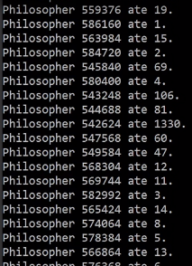
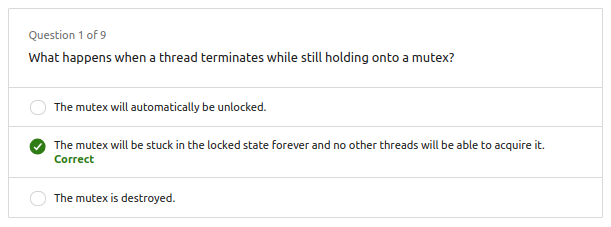
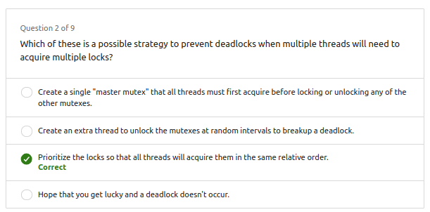
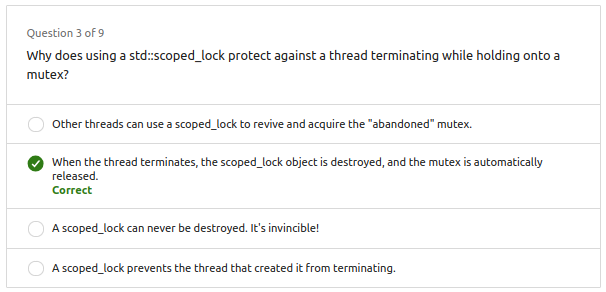
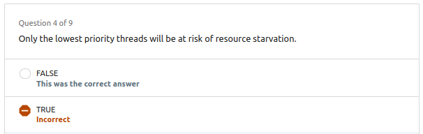
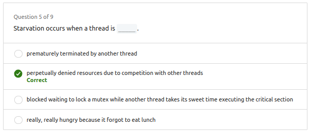
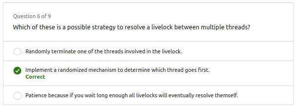
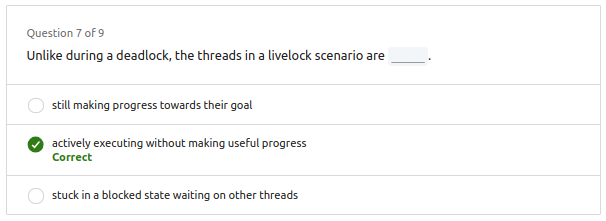
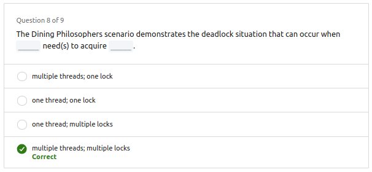
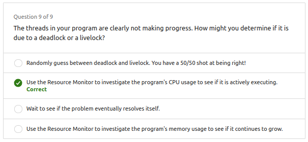

# 1. Deadlock

1. **Dining Philosopher's Problem:**

   - Descripción del escenario donde dos filósofos compiten por dos "locks" (palillos) para acceder a un recurso compartido (plato de sushi).
   - La toma de sushi se considera una sección crítica protegida por un proceso de exclusión mutua utilizando los "locks".

2. **Deadlock:**

   - Se introduce el concepto de "deadlock" cuando ambos filósofos alcanzan un punto donde cada uno ha adquirido un lock y está esperando al otro para liberar su lock.
   - La analogía se utiliza para explicar que en situaciones de concurrencia, evitar deadlock es un desafío común al usar mecanismos de exclusión mutua.

3. **Priorización de Locks:**

   - Se propone la solución de priorizar los locks para evitar deadlocks.
   - Los filósofos deciden adquirir el mismo lock primero, evitando así el problema de deadlock al competir por el mismo lock.

4. **Aplicación a Escenarios Realistas:**

   - Se menciona que, aunque el ejemplo del problema de los filósofos cenando puede no ser realista, ilustra el punto.
   - Se hace referencia a una aplicación bancaria donde cada cuenta bancaria tiene su propio "mutex" para garantizar operaciones seguras, y se advierte sobre la posibilidad de deadlocks en transferencias concurrentes entre cuentas.

5. **Importancia de Evitar Deadlocks:**

   - Se destaca la importancia de evitar deadlocks en programas concurrentes para garantizar la "liveness" (propiedad que requiere que los programas concurrentes avancen).
   - Aunque los procesos o hilos pueden tener que esperar su turno en una sección crítica, un programa bien escrito con "liveness" garantiza que todos eventualmente avanzarán.

6. **Enfoque en Competencia por los Mismos Locks:**
   - El ejemplo subraya cómo la competencia por los mismos locks entre hilos puede dar lugar a deadlocks, destacando la importancia de gestionar adecuadamente los locks en programas concurrentes.

# 2. Deadlock C++

```cpp
#include <thread>
#include <mutex>

int sushi_count = 5000;

void philosopher(std::mutex &first_chopstick, std::mutex &second_chopstick) {
    while (sushi_count > 0) {
        first_chopstick.lock();
        second_chopstick.lock();
        if (sushi_count) {
            sushi_count--;
        }
        second_chopstick.unlock();
        first_chopstick.unlock();
    }
}

int main() {
    std::mutex chopstick_a, chopstick_b;
    std::thread barron(philosopher, std::ref(chopstick_a), std::ref(chopstick_b));
    std::thread olivia(philosopher, std::ref(chopstick_b), std::ref(chopstick_a));
    barron.join();
    olivia.join();
    printf("The philosophers are done eating.\n");
}
```

En este caso se puede ver que los filósofos compiten por los mismos locks, lo que puede dar lugar a deadlocks, es decir, ambos filósofos adquieren un lock y esperan al otro para liberar su lock.

Para solucionarlo se puede priorizar los locks, es decir, ambos filósofos adquieren el mismo lock primero, evitando así el problema de deadlock al competir por el mismo lock.

**Asegurarse que los locks se toman en el mismo orden por los diferentes hilos.**

```cpp
std::thread barron(philosopher, std::ref(chopstick_a), std::ref(chopstick_b));
std::thread olivia(philosopher, std::ref(chopstick_a), std::ref(chopstick_b));
```

# 3. Abandoned Locks

Esto pasa cuando un hilo bloquea un lock pero nunca lo desbloquea por algo imprevisto que haya pasado internamente en su bloque de código.


- En el la siguiente función que simula un hilo, se puede ver que el lock se bloquea pero nunca se desbloquea, por lo que si se ejecuta esta función, el lock quedará bloqueado para siempre.


```cpp
void philosopher(std::mutex &chopsticks) {
    while (sushi_count > 0) {
        chopsticks.lock();
        if (sushi_count) {
            sushi_count--;
        }
        if (sushi_count == 10) {
            printf("This philosopher has had enough!\n");
            break;
        }
        chopsticks.unlock();
    }
}
```

- Para solucionar esto se puede utilizar un `std::scoped_lock` que se encarga de desbloquear el lock cuando el hilo termina su ejecución.

```cpp
void philosopher(std::mutex &chopsticks) {
    while (sushi_count > 0) {
        std::scoped_lock lock(chopsticks);
        if (sushi_count) {
            sushi_count--;
        }
        if (sushi_count == 10) {
            printf("This philosopher has had enough!\n");
            break;
        }
    }
}
```

# 4. Starvation - Inanición

Cuando un proceo muere por "hambre" (falta de tiempo de CPU) debido a que otro proceso siempre está en ejecución o siempre lo toma antes.

## 4.1. Ejemplo en C++:

Podemos observar que hay filósofos que comen más que otros, esto se debe a que hay filósofos que tienen más prioridad que otros, por lo que siempre van a comer antes que los otros.

```cpp
#include <thread>
#include <mutex>

int sushi_count = 5000;

void philosopher(std::mutex &chopsticks) {
    int sushi_eaten = 0;
    while (sushi_count > 0) {
        std::scoped_lock lock(chopsticks);
        if (sushi_count) {
            sushi_count--;
            sushi_eaten++;
        }
    }
    printf("Philosopher %d ate %d.\n", std::this_thread::get_id(), sushi_eaten);
}

int main() {
    std::mutex chopsticks;
    std::array<std::thread, 200> philosophers;
    for (size_t i=0; i<philosophers.size(); i++) {
        philosophers[i] = std::thread(philosopher,std::ref(chopsticks));
    }
    for (size_t i=0; i<philosophers.size(); i++) {
        philosophers[i].join();
    }
    printf("The philosophers are done eating.\n");
}
```
Resultados 



# 5. Livelock

Cuando dos o más hilos están bloqueados y todos están esperando que el otro se desbloquee, pero ninguno lo hace. Se puede solucionar agregando algún método para que los hilos compítan y el que gana se desbloquea.


# 6. Questions



















