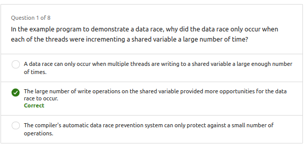
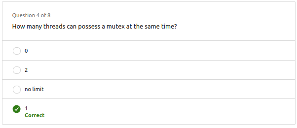
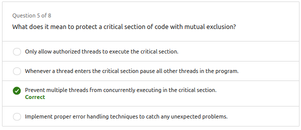
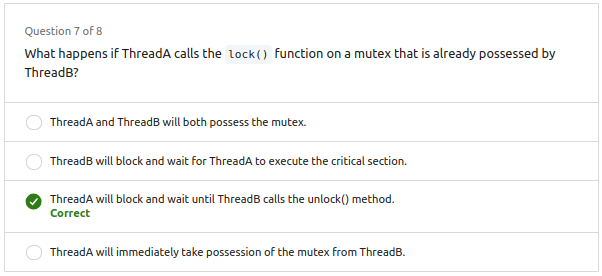
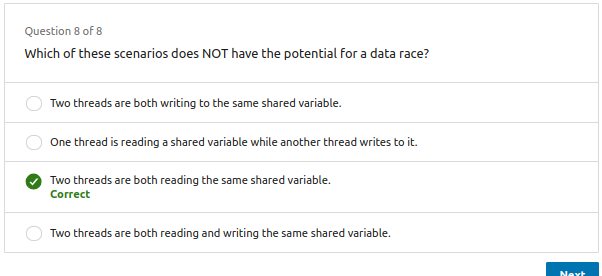

- [1. Data race](#1-data-race)
  - [1.1. Solución](#11-solución)
  - [1.2. Mutex](#12-mutex)
  - [1.3 Mutex vs Atomic objects](#13-mutex-vs-atomic-objects)
  - [1.4. Mutex on c++:](#14-mutex-on-c)
  - [1.6 Atomic objects on c++:](#16-atomic-objects-on-c)
  - [1.7. Questions](#17-questions)

# 1. Data race
- Dos o más hilos acceden a la misma variable compartida
- Al menos uno de los hilos realiza una modificación
## 1.1. Solución
- **Mutex (Exclusión mutua)**: Mecanismo de sincronización que permite a un hilo bloquear el acceso a una variable compartida.

|Detectar Data Races| Prevenir Data Races|
|-------------------|--------------------|
|Dificil de hacer   | Presta atención cuando dos o más hilos acceden al mismo recurso|

## 1.2. Mutex

- Mecanismo que implementa la exclusión mutua.
- Solo un hilo o proceso puede poseerlo a la vez.

- **Lock**: Adquirir el mutex
- **Unlock**: Liberar el mutex

## 1.3 Mutex vs Atomic objects

- **Mutex**: Mecanismo de sincronización que permite a un hilo bloquear el acceso a una variable compartida.
- **Atomic objects**: Mecanismo de sincronización que permite a un hilo bloquear el acceso a una variable compartida.
- Diferencias:
  - Atomic objects solo pueden ser usados con tipos de datos primitivos.
  - Mutex pueden ser usados con cualquier tipo de dato.
  - Atomic se usa para operaciones simples.
  - Mutex se usa para operaciones complejas, como un bloque de código.

## 1.4. Mutex on c++:

- [Before](<Ex_Files_C_Plus_Plus_Parallel_Prog/Exercise Files/CH03/03_04/begin/mutual_exclusion_demo.cpp>)

- [End](<Ex_Files_C_Plus_Plus_Parallel_Prog/Exercise Files/CH03/03_04/end/mutual_exclusion_demo.cpp>)

## 1.6 Atomic objects on c++:

- [Before](<Ex_Files_C_Plus_Plus_Parallel_Prog/Exercise Files/CH03/03_05/begin/atomic_object_demo.cpp>)

- [End](<Ex_Files_C_Plus_Plus_Parallel_Prog/Exercise Files/CH03/03_05/end/atomic_object_demo.cpp>)

## 1.7. Questions

