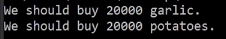
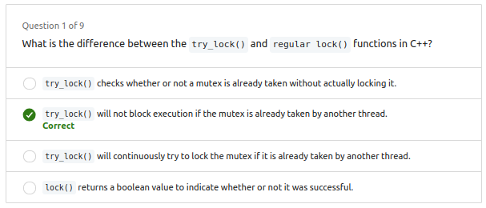
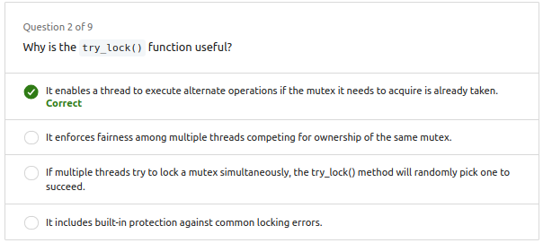
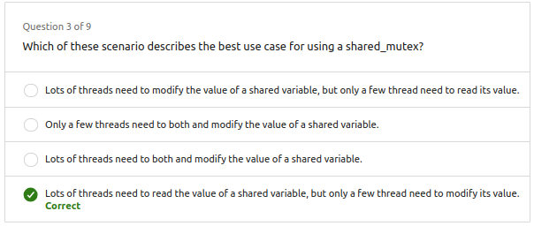
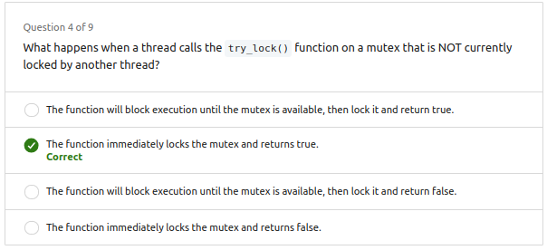
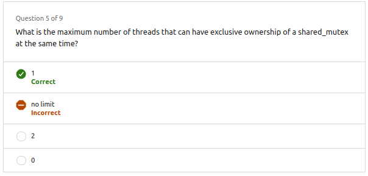
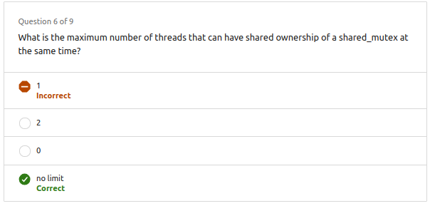
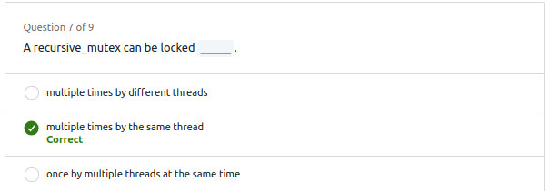
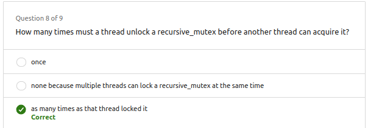
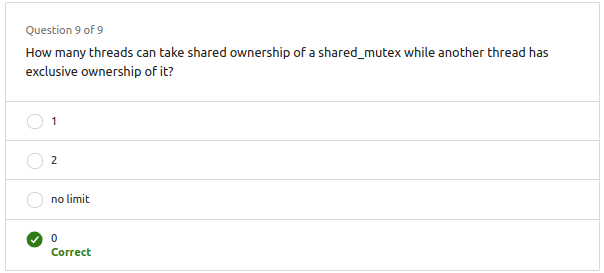

- [1. Recursive mutex](#1-recursive-mutex)
  - [Terminos comunes:](#terminos-comunes)
- [2. Try Lock](#2-try-lock)
- [3. Try Lock - Ejemplo](#3-try-lock---ejemplo)
- [4. Shared mutex](#4-shared-mutex)
- [5. Shared mutex - Ejemplo](#5-shared-mutex---ejemplo)
  - [Diferencias y Puntos Destacados:](#diferencias-y-puntos-destacados)
    - [Primer Código (Utilizando `std::mutex`):](#primer-código-utilizando-stdmutex)
    - [Segundo Código (Utilizando `std::shared_mutex`):](#segundo-código-utilizando-stdshared_mutex)
- [5. Questions](#5-questions)


# 1. Recursive mutex

Si un hilo intenta bloquear un mutex que ya está bloqueado, entra en una lista de espera, lo que podría provocar un estancamiento.

Para abordar la necesidad de bloquear un mutex varias veces antes de desbloquearlo, se introducen los **mutex reentrantes**. Un mutex reentrante permite que **un hilo lo bloquee varias veces y requiere un número igual de desbloqueos** antes de que otro hilo pueda bloquearlo. Esta característica es especialmente útil en escenarios donde puede ocurrir un bloqueo anidado, evitando estancamientos.

Las cerraduras reentrantes, o cerraduras recursivas, encuentran aplicación en casos como **funciones recursivas**, donde una función se llama a sí misma. Cuando se realiza una llamada recursiva dentro de una sección bloqueada, un mutex reentrante permite que el mutex se bloquee varias veces y luego se desbloquee un número igual de veces a medida que la recursión se desenvuelve.

El debate sobre las cerraduras reentrantes es subjetivo, con argumentos a favor y en contra de su uso. Un ejemplo práctico es su utilidad para evitar bloqueos en situaciones de bloqueo anidadas, como cuando una función llama a otra función dentro de una sección protegida. El uso de cerraduras reentrantes puede simplificar el código y adaptar cerraduras a sistemas existentes, pero las opiniones sobre su idoneidad varían entre los programadores.

## Terminos comunes:
- Reentrant mutex
- Reentrant lock
- Recursive mutex
- Recursive lock

```cpp
#include <thread>
#include <mutex>
#include <iostream>

unsigned int garlic_count = 0;
unsigned int potato_count = 0;
std::mutex pencil;

void add_garlic() {
    pencil.lock();
    garlic_count++;
    pencil.unlock();
}

void add_potato() {
    pencil.lock();
    potato_count++;
    pencil.unlock();
}

void shopper() {
    for (int i=0; i<10000; i++) {
        add_garlic();
        add_potato();
    }
}

int main() {
    std::thread barron(shopper);
    std::thread olivia(shopper);
    barron.join();
    olivia.join();
    printf("We should buy %u garlic.\n", garlic_count);
    printf("We should buy %u potatoes.\n", potato_count);
}
```



---

Usamos recursive_mutex para evitar el bloqueo anidado. Es decir, si un hilo intenta bloquear un mutex que ya está bloqueado, entra en una lista de espera, lo que podría provocar un estancamiento. Esto se puede evitar usando recursive_mutex.


```cpp
#include <thread>
#include <mutex>
#include <iostream>

unsigned int garlic_count = 0;
unsigned int potato_count = 0;
std::recursive_mutex pencil;

void add_garlic() {
    pencil.lock();
    garlic_count++;
    pencil.unlock();
}

void add_potato() {
    pencil.lock();
    potato_count++;
    add_garlic();
    pencil.unlock();
}

void shopper() {
    for (int i=0; i<10000; i++) {
        add_garlic();
        add_potato();
    }
}

int main() {
    std::thread barron(shopper);
    std::thread olivia(shopper);
    barron.join();
    olivia.join();
    printf("We should buy %u garlic.\n", garlic_count);
    printf("We should buy %u potatoes.\n", potato_count);
}
```

# 2. Try Lock

1. **Contexto de múltiples hilos y tareas:**
   - En un entorno con varios hilos, cada uno realizando diversas tareas.
   - La necesidad de acceder a un recurso compartido, como un bloc de notas.

2. **Desafío de bloqueo en adquisición de bloqueo:**
   - El bloqueo estándar podría no ser eficiente cuando se intenta adquirir un bloqueo ya tomado.
   - Ejemplo: Barron y Olivia realizan tareas diferentes pero comparten acceso al mismo recurso.

3. **Uso de "try lock" o "try enter":**
   - En lugar de bloqueo estándar, utilizan "try lock" o "try enter" como método no bloqueante.
   - Devuelve inmediatamente, permitiendo al hilo continuar si no puede adquirir el bloqueo de inmediato.

4. **Ventajas del "try lock":**
   - Permite a Barron realizar otras tareas mientras intenta adquirir el bloqueo.
   - Optimiza la eficiencia al no detener el hilo innecesariamente.

5. **Funcionamiento del "try lock":**
   - Retorna true si el bloqueo se obtiene con éxito, false si ya está bloqueado por otro hilo.
   - Permite al hilo saber si fue exitoso en adquirir el bloqueo.

6. **Ejemplo ilustrativo con lápices y notepads:**
   - Barron usa la analogía de lápices y notepads para explicar el concepto de "try lock".
   - Olivia desbloquea el lápiz, dejándolo disponible para otro hilo.

7. **Analogía de la fiesta para entender "try lock":**
   - Se compara con estar en una fiesta donde todos necesitan usar un baño, pero solo uno puede usarlo a la vez.
   - Ilustra cómo se puede intentar acceder al baño sin esperar bloqueado, similar al funcionamiento del "try lock".

8. **Eficiencia y flexibilidad del "try lock":**
   - Permite que cada hilo continúe con otras tareas si no puede adquirir el bloqueo de inmediato.
   - Optimiza el uso de recursos compartidos en entornos con múltiples hilos.

# 3. Try Lock - Ejemplo

La función `try_lock()` de un objeto std::mutex intenta adquirir el bloqueo del mutex, pero en lugar de esperar si el bloqueo no está disponible, devuelve inmediatamente indicando si pudo adquirir el bloqueo o no.

**Original code:**

```cpp
#include <thread>
#include <mutex>
#include <chrono>

unsigned int items_on_notepad = 0;
std::mutex pencil;

void shopper(const char* name) {
    int items_to_add = 0;
    while (items_on_notepad <= 20) {
        if (items_to_add) { // add item(s) to shared items_on_notepad
            pencil.lock();
            items_on_notepad += items_to_add;
            printf("%s added %u item(s) to notepad.\n", name, items_to_add);
            items_to_add = 0;
            std::this_thread::sleep_for(std::chrono::milliseconds(300)); // time spent writing
            pencil.unlock();
        } else { // look for other things to buy
            std::this_thread::sleep_for(std::chrono::milliseconds(100)); // time spent searching
            items_to_add++;
            printf("%s found something else to buy.\n", name);
        }
    }
}

int main() {
    auto start_time = std::chrono::steady_clock::now();
    std::thread barron(shopper, "Barron");
    std::thread olivia(shopper, "Olivia");
    barron.join();
    olivia.join();
    auto elapsed_time = std::chrono::duration_cast<std::chrono::milliseconds>(std::chrono::steady_clock::now() - start_time).count();
    printf("Elapsed Time: %.2f seconds\n", elapsed_time/1000.0);
}
```

En este código, el hilo adquiere el bloqueo del mutex utilizando `pencil.lock()` antes de realizar operaciones críticas y lo libera explícitamente después con `pencil.unlock()`. Esto asegura que solo un hilo a la vez pueda ejecutar las operaciones dentro de la sección crítica.

---

**Adding try_lock() :**
```cpp
#include <thread>
#include <mutex>
#include <chrono>

unsigned int items_on_notepad = 0;
std::mutex pencil;

void shopper(const char* name) {
    int items_to_add = 0;
    while (items_on_notepad <= 20) {
        if (items_to_add && pencil.try_lock()) { // add item(s) to shared items_on_notepad
            items_on_notepad += items_to_add;
            printf("%s added %u item(s) to notepad.\n", name, items_to_add);
            items_to_add = 0;
            std::this_thread::sleep_for(std::chrono::milliseconds(300)); // time spent writing
            pencil.unlock();
        } else { // look for other things to buy
            std::this_thread::sleep_for(std::chrono::milliseconds(100)); // time spent searching
            items_to_add++;
            printf("%s found something else to buy.\n", name);
        }
    }
}

int main() {
    std::thread barron(shopper, "Barron");
    std::thread olivia(shopper, "Olivia");
    auto start_time = std::chrono::steady_clock::now();
    barron.join();
    olivia.join();
    auto elapsed_time = std::chrono::duration_cast<std::chrono::milliseconds>(std::chrono::steady_clock::now() - start_time).count();
    printf("Elapsed Time: %.2f seconds\n", elapsed_time/1000.0);
}
```

En este código, el hilo utiliza `pencil.try_lock()` para intentar adquirir el bloqueo del mutex. Si el bloqueo se adquiere con éxito, el hilo realiza las operaciones dentro de la sección crítica y luego libera el bloqueo. Si `try_lock()` no puede adquirir el bloqueo (porque ya está bloqueado por otro hilo), el hilo continúa buscando cosas para comprar sin esperar.

---

# 4. Shared mutex

1. **Importancia de Locks o Mutex:**
   - Se utilizan para proteger secciones críticas de código y prevenir carreras de datos cuando varios hilos acceden simultáneamente a la misma memoria.
   - Se destaca el peligro cuando al menos un hilo está escribiendo en la ubicación compartida.

2. **Uso de Mutex Estándar:**
   - La utilización de un mutex estándar limita el acceso, permitiendo que solo un hilo a la vez utilice el recurso compartido, ya sea para lectura o escritura.

3. **Introducción a Reader-Writer Locks:**
   - Se presenta la idea de cerraduras de lectura-escritura como una alternativa eficiente, especialmente cuando hay muchos hilos que solo necesitan leer.

4. **Modos de Reader-Writer Locks:**
   - Una cerradura de lectura-escritura puede bloquearse en modo de lectura compartida, permitiendo múltiples lecturas simultáneas, o en modo de escritura exclusiva, limitando el acceso a un hilo a la vez para escritura.

5. **Ejemplo Práctico:**
   - Se ilustra el uso de una cerradura de lectura-escritura en un escenario de calendario compartido entre dos hilos.

6. **Elección entre Mutex y Reader-Writer Locks:**
   - La elección depende del escenario, y se señala que las cerraduras de lectura-escritura pueden mejorar el rendimiento cuando hay más hilos de lectura que de escritura.

7. **Consideraciones de Implementación:**
   - Se advierte que las cerraduras de lectura-escritura son más complicadas de implementar y pueden utilizar más recursos internos para realizar un seguimiento del número de lectores.

8. **Variabilidad según el Lenguaje de Programación:**
   - Se destaca que puede haber diferencias en la implementación según el lenguaje de programación, afectando el rendimiento y la preferencia entre lectores y escritores al adquirir el bloqueo.

# 5. Shared mutex - Ejemplo

**Original code:**

```cpp
#include <thread>
#include <mutex>
#include <chrono>
#include <iostream>

char WEEKDAYS[7][10] = {"Sunday", "Monday", "Tuesday", "Wednesday", "Thursday", "Friday", "Saturday"};
int today = 0;
std::mutex marker;

void calendar_reader(const int id) {
    for (int i=0; i<7; i++) {
        marker.lock();
        printf("Reader-%d sees today is %s\n", id, WEEKDAYS[today]);
        std::this_thread::sleep_for(std::chrono::milliseconds(100));
        marker.unlock();
    }
}

void calendar_writer(const int id) {
    for (int i=0; i<7; i++) {
        marker.lock();
        today = (today + 1) % 7;
        printf("Writer-%d updated date to %s\n", id, WEEKDAYS[today]);
        std::this_thread::sleep_for(std::chrono::milliseconds(100));
        marker.unlock();        
    }
}

int main() {
    // create ten reader threads ...but only two writer threads
    std::array<std::thread, 10> readers;
    for (unsigned int i=0; i<readers.size(); i++) {
        readers[i] = std::thread(calendar_reader, i);
    }
    std::array<std::thread, 2> writers;
    for (unsigned int i=0; i<writers.size(); i++) {
        writers[i] = std::thread(calendar_writer, i);
    }

    // wait for readers and writers to finish
    for (unsigned int i=0; i<readers.size(); i++) {
        readers[i].join();
    }
    for (unsigned int i=0; i<writers.size(); i++) {
        writers[i].join();
    }
}
```

---

**Adding shared mutex code:**


```cpp
#include <thread>
#include <mutex>
#include <chrono>
#include <shared_mutex>
#include <iostream>

char WEEKDAYS[7][10] = {"Sunday", "Monday", "Tuesday", "Wednesday", "Thursday", "Friday", "Saturday"};
int today = 0;
std::shared_mutex marker;

void calendar_reader(const int id) {
    for (int i=0; i<7; i++) {
        marker.lock_shared();
        printf("Reader-%d sees today is %s\n", id, WEEKDAYS[today]);
        std::this_thread::sleep_for(std::chrono::milliseconds(100));
		marker.unlock_shared();	
    }
}

void calendar_writer(const int id) {
    for (int i=0; i<7; i++) {
        marker.lock();
        today = (today + 1) % 7;
        printf("Writer-%d updated date to %s\n", id, WEEKDAYS[today]);
        std::this_thread::sleep_for(std::chrono::milliseconds(100));
        marker.unlock();        
    }
}

int main() {
    // create ten reader threads ...but only two writer threads
    std::array<std::thread, 10> readers;
    for (unsigned int i=0; i<readers.size(); i++) {
        readers[i] = std::thread(calendar_reader, i);
    }
    std::array<std::thread, 2> writers;
    for (unsigned int i=0; i<writers.size(); i++) {
        writers[i] = std::thread(calendar_writer, i);
    }

    // wait for readers and writers to finish
    for (unsigned int i=0; i<readers.size(); i++) {
        readers[i].join();
    }
    for (unsigned int i=0; i<writers.size(); i++) {
        writers[i].join();
    }
}
```

---

## Diferencias y Puntos Destacados:

Ambos códigos implementan un escenario donde múltiples hilos leen y escriben en un calendario compartido, utilizando un mutex en el primer código y un `shared_mutex` (mutex compartido) en el segundo código. Aquí están las diferencias clave:

### Primer Código (Utilizando `std::mutex`):

```cpp
#include <mutex>

std::mutex marker;

// ...

marker.lock();
// Operaciones críticas
marker.unlock();
```

### Segundo Código (Utilizando `std::shared_mutex`):

```cpp
#include <shared_mutex>

std::shared_mutex marker;

// ...

marker.lock_shared();
// Operaciones de lectura (múltiples hilos pueden tener bloqueo compartido simultáneamente)
marker.unlock_shared();

// Operaciones de escritura (un único hilo puede tener bloqueo exclusivo)
marker.lock();
// Operaciones críticas
marker.unlock();
```


1. **`std::mutex` vs `std::shared_mutex`:**
   - En el primer código, se utiliza un `std::mutex`, que proporciona bloqueo exclusivo para cualquier hilo que lo adquiera.
   - En el segundo código, se utiliza un `std::shared_mutex`, que permite bloqueo compartido para lecturas concurrentes y bloqueo exclusivo para escrituras.

2. **Lock y Unlock en Lecturas:**
   - En el primer código, todas las operaciones (lecturas y escrituras) están protegidas por un único bloqueo (`marker.lock()` y `marker.unlock()`).
   - En el segundo código, las operaciones de lectura están protegidas por un bloqueo compartido (`marker.lock_shared()` y `marker.unlock_shared()`), lo que permite lecturas concurrentes.

Ambos códigos logran el mismo propósito, pero el segundo código con `std::shared_mutex` es más flexible y puede ser más eficiente en situaciones donde hay múltiples lecturas concurrentes.


# 5. Questions




















