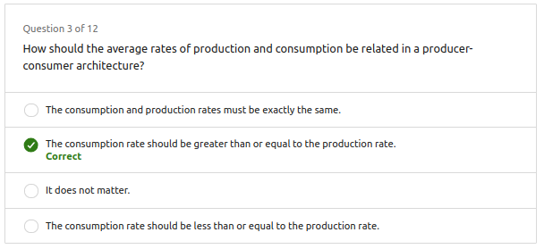
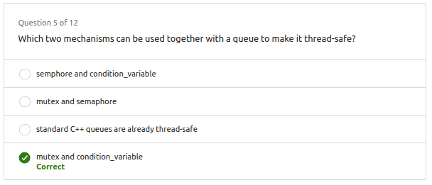
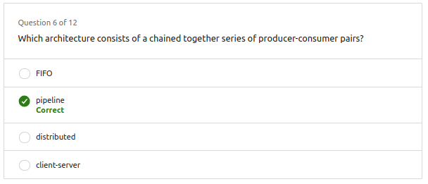

- [1. Condition variable on parallel programming](#1-condition-variable-on-parallel-programming)
- [2. Producer consumer problem](#2-producer-consumer-problem)
- [3. Semaphore](#3-semaphore)
  - [3.1. Mutex vs Semaphore](#31-mutex-vs-semaphore)
  - [3.2. Semaphore in C++](#32-semaphore-in-c)
- [4. Questions](#4-questions)


# 1. Condition variable on parallel programming

Estas son condiciones que se pueden usar para sincronizar hilos. La idea es que un hilo espere la notificación de otro hilo para continuar su ejecución y que no esté constantemente preguntando si puede continuar.

En el siguiente ejemplo se representará el escenario en el que una persona espera a su turno de tomar la sopa, por lo que continuamente pregunta si es su turno.

[Code here](<Ex_Files_Parallel_C_Plus_Plus_Pt2/Exercise Files/CH01/01_02/begin/condition_variable_demo.cpp>)

```c++
int soup_servings = 10;
std::mutex slow_cooker_lid;

void hungry_person(int id) {
    int put_lid_back = 0;
    while (soup_servings > 0) {
        std::unique_lock<std::mutex> lid_lock(slow_cooker_lid); // Levanta la tapa de la olla
        if ((id == soup_servings % 2) && (soup_servings > 0)) { // Es tu turno de tomar sopa?
            soup_servings--; // Es tu turno, toma sopa!
        } else {
            put_lid_back++; // No es tu turno, pon la tapa de nuevo
        }
    }
    printf("Person %d put the lid back %u times.\n", id, put_lid_back);
}
```

Como solución se puede usar una variable de condición, que es una variable que se puede usar para notificar a un hilo que algo ha sucedido. En este caso, se notificará a los hilos que es su turno de tomar sopa.

[Code here](<Ex_Files_Parallel_C_Plus_Plus_Pt2/Exercise Files/CH01/01_02/end/condition_variable_demo.cpp>)

```c++
int soup_servings = 10;
std::mutex slow_cooker_lid;
std::condition_variable soup_taken;

void hungry_person(int id) {
    int put_lid_back = 0;
    while (soup_servings > 0) {
        std::unique_lock<std::mutex> lid_lock(slow_cooker_lid); // Levanta la tapa de la olla
        while ((id != soup_servings % 5) && (soup_servings > 0)) { // Es tu turno de tomar sopa?
            put_lid_back++; // Pon la tapa, no es tu turno
            soup_taken.wait(lid_lock); // ...y espera...
        }
        if (soup_servings > 0) {
            soup_servings--; // Es tu turno de tomar sopa
            lid_lock.unlock(); // pon la tapa de nuevo
            soup_taken.notify_all(); // notifica a los demás hilos que es su turno
        }
    }
    printf("Person %d put the lid back %u times.\n", id, put_lid_back);
}
```

# 2. Producer consumer problem

La siguiente clase de ejemplo representa de forma simple el problema del productor-consumidor. En este caso, el productor es el cocinero que sirve la sopa y el consumidor es la persona que toma la sopa.


[Source code](<Ex_Files_Parallel_C_Plus_Plus_Pt2/Exercise Files/CH01/01_04/begin/producer_consumer_demo.cpp>)

```c++
class ServingLine {
    public:
        void serve_soup(int i) {
            soup_queue.push(i);
        }

        int take_soup() {
            int bowl = soup_queue.front();
            soup_queue.pop();
            return bowl;
        }

    private:
        std::queue<int> soup_queue;
};
```
Usar esta clase nos da errores porque no hay ningún mecanismo incorporado para protejer de las data race y otros problemas.

---

Lo solucionamos ocn el siguiente código:

[Source code](<Ex_Files_Parallel_C_Plus_Plus_Pt2/Exercise Files/CH01/01_04/end/producer_consumer_demo.cpp>)

```c++
class ServingLine {
    public:
        void serve_soup(int i) {
            std::unique_lock<std::mutex> ladle_lock(ladle);
            soup_queue.push(i);
            ladle_lock.unlock();
            soup_served.notify_one();
        }

        int take_soup() {
            std::unique_lock<std::mutex> ladle_lock(ladle);
            while (soup_queue.empty()) {
                soup_served.wait(ladle_lock);
            }
            int bowl = soup_queue.front();
            soup_queue.pop();
            return bowl;
        }
        
    private:
        std::queue<int> soup_queue;
        std::mutex ladle;
        std::condition_variable soup_served;
};
```


# 3. Semaphore

Otro mecanismo de sincronización. Un semáforo es una variable que puede tener un valor entero no negativo y que soporta dos operaciones principales:

- **Wait (Esperar):** Si el valor del semáforo es mayor que cero, decrementa el valor y permite al hilo o proceso continuar. Si el valor es cero, el hilo o proceso que realiza la operación Wait se bloquea hasta que el valor sea mayor que cero.

- **Signal (Señal):** Incrementa el valor del semáforo. Si hay otros hilos o procesos bloqueados en una operación Wait, uno de ellos se desbloquea y puede continuar.

Existen dos tipos principales de semáforos:

- **Semáforos binarios:** Tienen solo dos valores posibles (0 o 1). Se utilizan comúnmente para representar mutexes o bloqueos.

- **Semáforos contadores:** Pueden tener valores mayores a uno y se utilizan para controlar el acceso a un número específico de recursos compartidos.

## 3.1. Mutex vs Semaphore

|Mutex|Semaphore|
|---|---|
|Puede ser adquirido por un solo hilo a la vez|Puede ser adquirido por múltiples hilos a la vez|


## 3.2. Semaphore in C++

Nosotros podemos usar esta clase de C++ para representar semáforos

```c++
class Semaphore {
public:
    Semaphore(unsigned long init_count) {
        count_ = init_count;
    }

    void acquire() { // decrement the internal counter
        std::unique_lock<std::mutex> lck(m_);
        while (!count_) {
            cv_.wait(lck);
        }
        count_--;
    }

    void release() { // increment the internal counter
        std::unique_lock<std::mutex> lck(m_);
        count_++;
        lck.unlock();
       cv_.notify_one();
    }

private:
    std::mutex m_;
    std::condition_variable cv_;
    unsigned long count_;
};
```

# 4. Questions










*Que es un monitor?*