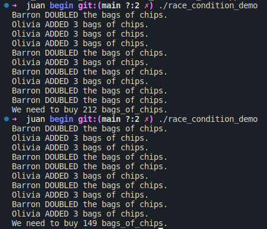
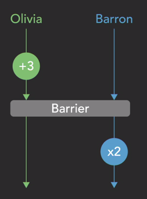
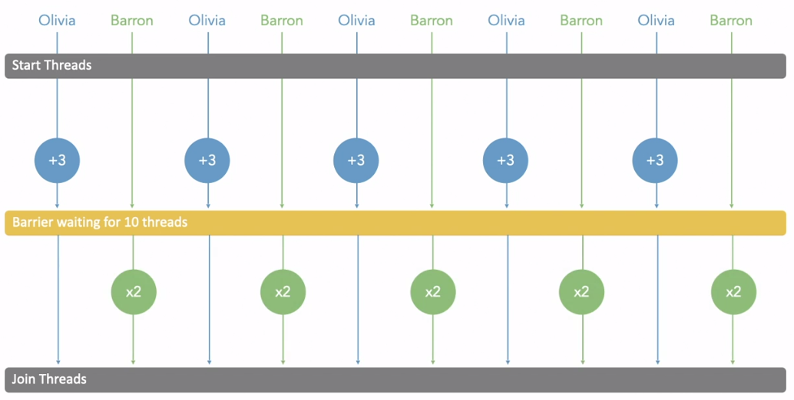
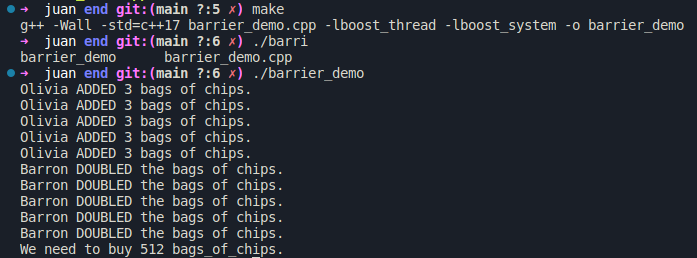
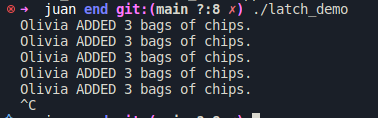
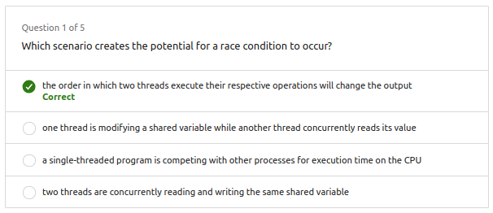
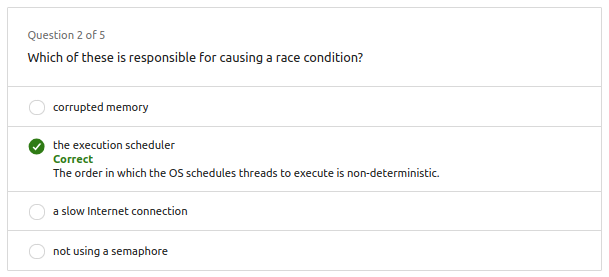
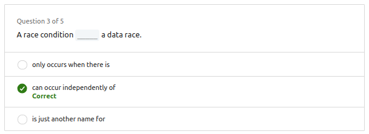
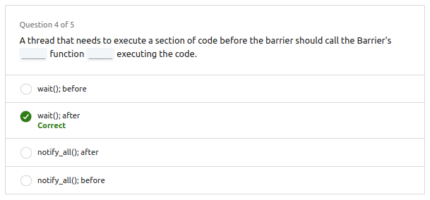
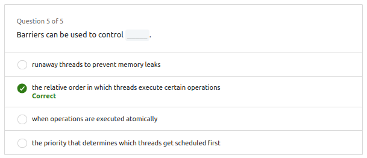

# 01. Race condition

1. **Definición General:**
   - Una race condition (condición de carrera) es un problema en la temporización u orden de ejecución de un programa concurrente que causa un comportamiento incorrecto.

2. **Diferencia con Data Races:**

    |Data races|Race conditions|
    |---|---|
    |Ocurren cuando dos o más hilos acceden simultáneamente a la misma ubicación de memoria, lo que puede resultar en escrituras incorrectas o lecturas de valores incorrectos.| Son fallos en la temporización u orden de ejecución que generan resultados incorrectos. |

1. **Relación entre Data Races y Race Conditions:**
   - Muchas race conditions son causadas por data races.
   - Sin embargo, **no son dependientes entre sí**; es posible tener data races sin una race condition y viceversa.

2. **Ejemplo Práctico:**
   - Se presenta un escenario con un recurso compartido (lista de compras para comprar chips) y varios hilos (personas) que acceden y modifican ese recurso.
   - Se utiliza un lápiz como mutex para proteger la lista de compras, permitiendo que solo la persona o hilo con el lápiz pueda ver o modificar la lista.

3. **Ejemplo de Race Condition:**
   - A pesar de la protección contra data races (usando el lápiz como mutex), existe la posibilidad de una race condition debido al orden no determinista en que los hilos ejecutan sus operaciones.
   - Dos personas sugieren operaciones diferentes: una propone duplicar y luego sumar, mientras que otra propone sumar y luego duplicar.
   - Dependiendo del orden de ejecución, se obtienen resultados diferentes (ocho bolsas en un caso y cinco bolsas en otro), lo que constituye una race condition.

4. **Dificultad en Detectar Race Conditions:**
   - Las race conditions pueden ser difíciles de descubrir en la práctica.
   - Aunque un programa puede ejecutarse correctamente durante millones de veces en desarrollo y pruebas, un cambio en el orden de ejecución puede causar un resultado incorrecto.
   - No hay un método único para detectar todas las race conditions, y a veces, intentar depurar o afectar el tiempo de ejecución puede hacer que la race condition no ocurra `(heisenbug)`.

## 1.2. Ejemplo en C++

[Source code](<Ex_Files_Parallel_C_Plus_Plus_Pt2/Exercise Files/CH02/02_02/begin/race_condition_demo.cpp>)

```cpp
unsigned int bags_of_chips = 1; // start with one on the list
std::mutex pencil;

void cpu_work(unsigned long workUnits) {
    unsigned long x = 0;
    for (unsigned long i; i<workUnits*1000000; i++) {
        x++;
    }
}

void barron_shopper() {
    cpu_work(1); // do a bit of work first
    std::scoped_lock<std::mutex> lock(pencil);
    bags_of_chips *= 2;
    printf("Barron DOUBLED the bags of chips.\n");
}

void olivia_shopper() {
    cpu_work(1); // do a bit of work first
    std::scoped_lock<std::mutex> lock(pencil);
    bags_of_chips += 3;
    printf("Olivia ADDED 3 bags of chips.\n");
}

int main() {
    std::thread shoppers[10];
    for (int i=0; i<10; i+=2) {
        shoppers[i] = std::thread(barron_shopper);
        shoppers[i+1] = std::thread(olivia_shopper);
    }
    for (auto& s : shoppers) {
        s.join();
    }
    printf("We need to buy %u bags_of_chips.\n", bags_of_chips);
}
```

**`Resultado:`** Diferentes ejecuciones producen diferentes resultados.



# 02. Barrier (Barrera)

1. **Necesidad de Sincronización:**
   - Se menciona que para evitar que ocurra una race condition, es necesario sincronizar las acciones de los hilos y ejecutar las operaciones en el orden correcto.

2. **Definición de Barrier:**
   - Una barrier es descrita como un punto de detención para un grupo de hilos que impide que avancen hasta que todos o suficientes hilos hayan alcanzado la barrera.

3. **Analogía con un Equipo Deportivo:**
   - La transcripción compara los hilos esperando en una barrera con jugadores de un equipo deportivo que se reúnen para un "huddle" (reunión).
   - Antes de unirse al "huddle", los jugadores pueden estar ocupados con diversas actividades individuales. De manera similar, los hilos realizan operaciones individuales antes de llegar a la barrera.

4. **Funcionamiento de la Barrier:**
   - Los hilos esperan en la barrera hasta que todos los compañeros de equipo llegan. Una vez que todos están presentes, se rompe la barrera y los hilos pueden continuar ejecutándose.

5. **Aplicación para Evitar la Race Condition:**
   - Se propone utilizar una barrera para resolver la race condition en el ejemplo práctico.
   - Los hilos se reúnen en la barrera para sincronizar la ejecución de sus operaciones en el orden correcto.

6. **Ejemplo Práctico:**
   - Antes de la barrera, un hilo (Olivia) completa la operación de agregar tres bolsas de chips a la lista.
   - Después de la barrera, otro hilo (Barron) duplica la cantidad.
   - La barrera asegura que la secuencia de ejecución de los hilos no importa, ya que se garantiza que Olivia siempre agrega tres bolsas antes de la barrera, y Barron siempre duplica después de la barrera.

    

7. **Flexibilidad de la Barrier:**
   - Aunque la secuencia de ejecución de los hilos puede ser diferente cada vez que se ejecuta el programa, la barrera garantiza un resultado consistente y evita race conditions.

## 2.2. Ejemplo en C++



Para hcer esto podemos usar la librería `#include <boost/thread/barrier.hpp>` que nos permite crear una barrera.

[Source code](<Ex_Files_Parallel_C_Plus_Plus_Pt2/Exercise Files/CH02/02_04/end/barrier_demo.cpp>)

```cpp
#include <thread>
#include <mutex>
#include <boost/thread/barrier.hpp>

unsigned int bags_of_chips = 1; // start with one on the list
std::mutex pencil;
boost::barrier fist_bump(10);

void cpu_work(unsigned long workUnits) {
    unsigned long x = 0 ;
    for (unsigned long i; i<workUnits*1000000; i++) {
        x++;
    }
}

void barron_shopper() {
    cpu_work(1); // do a bit of work first
    fist_bump.wait();
    std::scoped_lock<std::mutex> lock(pencil);
    bags_of_chips *= 2;
    printf("Barron DOUBLED the bags of chips.\n");
}

void olivia_shopper() {
    cpu_work(1); // do a bit of work first
    {
        std::scoped_lock<std::mutex> lock(pencil);
        bags_of_chips += 3;
    }
        printf("Olivia ADDED 3 bags of chips.\n");
    fist_bump.wait();
}

int main() {
    std::thread shoppers[10];
    for (int i=0; i<10; i+=2) {
        shoppers[i] = std::thread(barron_shopper);
        shoppers[i+1] = std::thread(olivia_shopper);
    }
    for (auto& s : shoppers) {
        s.join();
    }
    printf("We need to buy %u bags_of_chips.\n", bags_of_chips);
}
```

> [!NOTE] 
> Para compilar el código se necesitan algunas librerías adicionales. Para **debian**: `sudo apt-get install libboost-all-dev` y para la **compilación**: `g++ main.cpp -o main -lboost_thread -lboost_system`

Resultado (determinista):




# 03. Latch

Es un mecanismo de sincronización relacionado con las barreras que permite que uno o más hilos esperen hasta que se completen ciertas operaciones realizadas en otros hilos. Aquí hay una explicación más detallada:

1. **Inicialización del Latch:**
   - Un "latch" se inicializa con un valor de conteo dado. Este valor de conteo representa la cantidad de veces que se debe llamar a la función `count_down` para liberar el "latch".

2. **Uso del Latch:**
   - Los hilos pueden utilizar el "latch" de dos maneras:
      - Esperar en el "latch" hasta que el valor de conteo llegue a cero, de manera similar a cómo los hilos pueden esperar en una barrera.
      - Decrementar el valor de conteo llamando a la función `count_down`.

3. **Diferencia clave con una Barrera:**
   - La diferencia principal entre un "latch" y una barrera radica en cómo se libera. Una barrera se libera cuando se alcanza un cierto número de hilos que esperan en ella, mientras que un "latch" se libera después de que la función `count_down` se llama suficientes veces para reducir el valor de conteo a cero.

4. **Ejemplo de Uso:**
   - En el ejemplo proporcionado, se usa un "latch" en lugar de una barrera. Los hilos de Olivia decrementan el valor de conteo llamando a `count_down` después de realizar su tarea. Los hilos principales esperan en el "latch" hasta que el valor de conteo llega a cero, momento en el que se liberan para continuar.

5. **Consideraciones:**
   - Es importante tener en cuenta que si el valor de conteo inicial es demasiado grande y no se llama a `count_down` lo suficientes veces, los hilos pueden quedarse esperando en el "latch". Por lo tanto, al utilizar "latches", es esencial asegurarse de que el programa llame a la función `count_down` el número necesario de veces para evitar bloqueos.

6. **Usos Comunes:**
   - Los "latches" a menudo se utilizan con un valor de conteo inicial de uno para actuar como una puerta simple. Varios hilos pueden esperar en la puerta hasta que otro hilo controlador llame a `count_down` una vez, liberando a los hilos en espera para continuar. También se pueden utilizar con otros valores iniciales para coordinar la ejecución de un número específico de hilos antes de que otros puedan proceder.

## 3.2. Ejemplo en C++

[Source code](<Ex_Files_Parallel_C_Plus_Plus_Pt2/Exercise Files/CH02/02_05/end/latch_demo.cpp>)

```cpp
#include <thread>
#include <mutex>
#include <boost/thread/latch.hpp>

unsigned int bags_of_chips = 1; // start with one on the list
std::mutex pencil;
boost::latch fist_bump(10);

void cpu_work(unsigned long workUnits) {
    unsigned long x;
    for (unsigned long i; i<workUnits*1000000; i++) {
        x++;
    }
}

void barron_shopper() {
    cpu_work(1); // do a bit of work first
    fist_bump.wait();
    std::scoped_lock<std::mutex> lock(pencil);
    bags_of_chips *= 2;
    printf("Barron DOUBLED the bags of chips.\n");
}

void olivia_shopper() {
    cpu_work(1); // do a bit of work first
    {
        std::scoped_lock<std::mutex> lock(pencil);
        bags_of_chips += 3;
    }
    printf("Olivia ADDED 3 bags of chips.\n");
    fist_bump.count_down();
}

int main() {
    std::thread shoppers[10];
    for (int i=0; i<10; i+=2) {
        shoppers[i] = std::thread(barron_shopper);
        shoppers[i+1] = std::thread(olivia_shopper);
    }
    for (auto& s : shoppers) {
        s.join();
    }
    printf("We need to buy %u bags_of_chips.\n", bags_of_chips);
}
```

Este código en realidad tiene un error intencional. El latch se inicializa con un valor de 10, pero solo se llama a `count_down` cinco veces. Esto significa que el hilo principal se bloqueará esperando en el latch para siempre. Para solucionar esto, cambie el valor de conteo inicial a `5`.





# 04. Questions











