- [Términos importantes](#términos-importantes)
- [Weak Scaling](#weak-scaling)
- [Ley de Amdahl](#ley-de-amdahl)
- [Eficiency](#eficiency)
- [Questions](#questions)

# Términos importantes

- `Throughput`: Cantidad de trabajo realizado por unidad de tiempo.

    

- `Latency`: El tiempo que demora realizar una tarea.

    

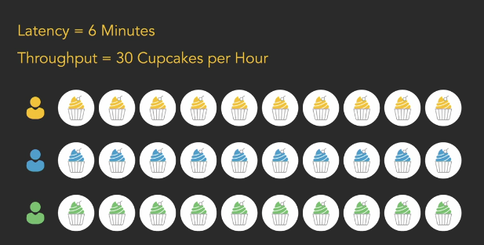

- `Speedup`: Es la mejora de la performance de un programa al ejecutarlo en una computadora más rápida.

    

    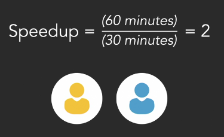

# Weak Scaling

Es cuando se aumenta la cantidad de procesadores para resolver un problema más grande.

# Ley de Amdahl

La ley de Amdahl es una fórmula que sirve medir que tanto se puede mejorar la performance de un programa al paralelizarlo.

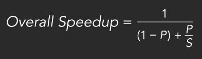

- P: Porcentaje de código paralelizable.
- S: Speedup de la porción paralelizable.

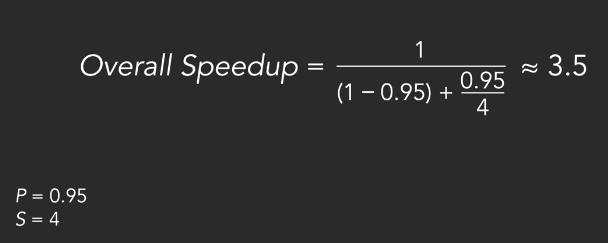

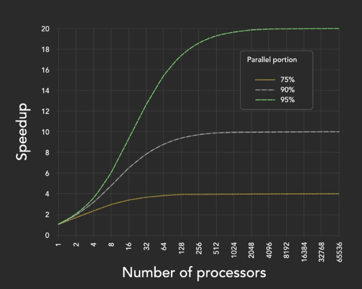

> Notamos que usar múltiples procesadores para la computación paralela solo es útil para programas altamente paralalelizables.

# Eficiency

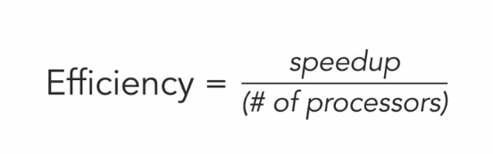

- Si el speedup es menor que 1, significará que el programa se ejecuta más lento al paralelizarlo.
- Si el speedup es mayor que 1, significará que el programa se ejecuta más rápido al paralelizarlo.

# Questions

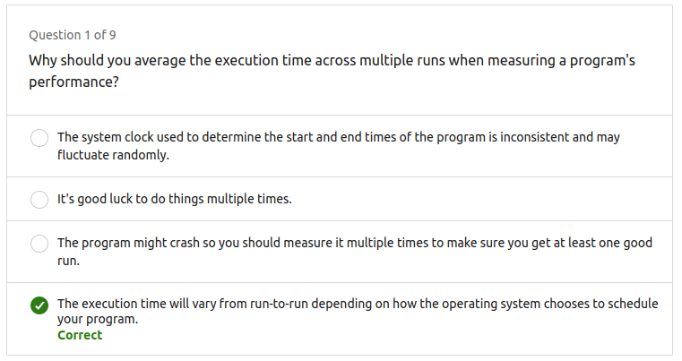

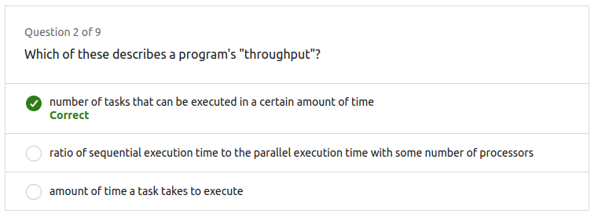

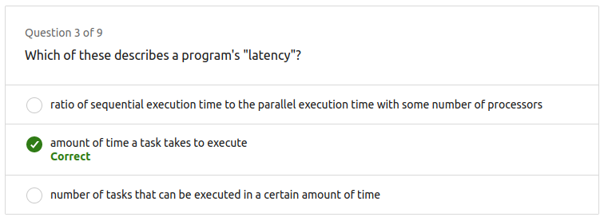

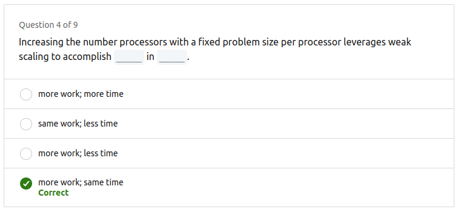

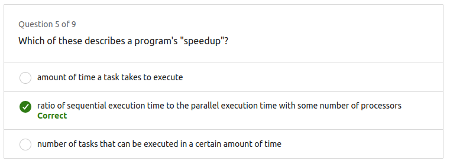

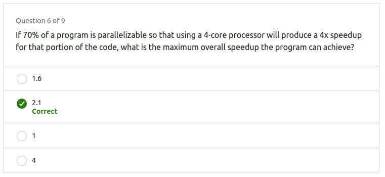

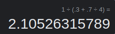

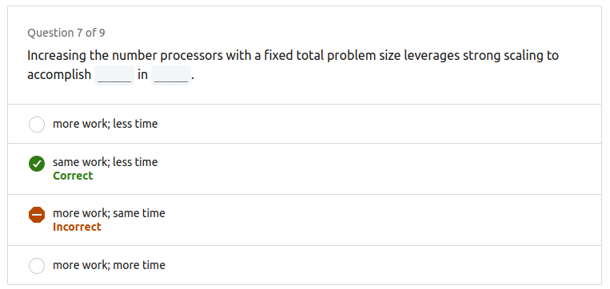

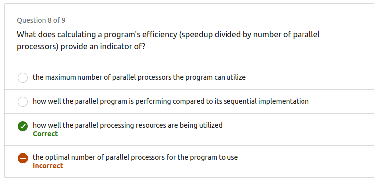

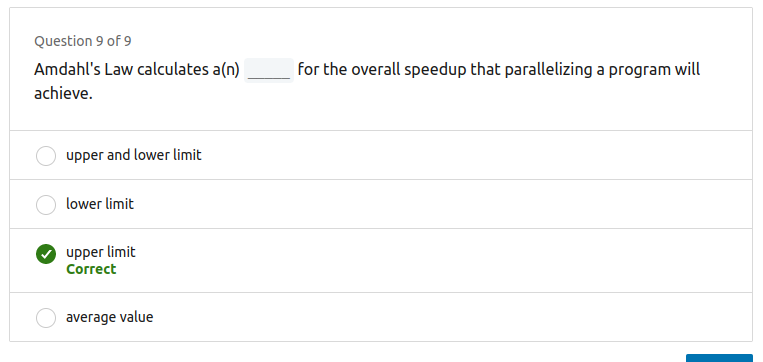

