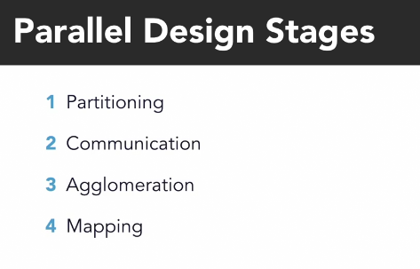

# Partitioning:

Romper el problema en partes más pequeñas.

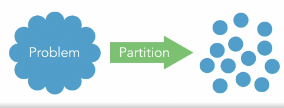

## Domain decomposition (Dominio de descomposición):

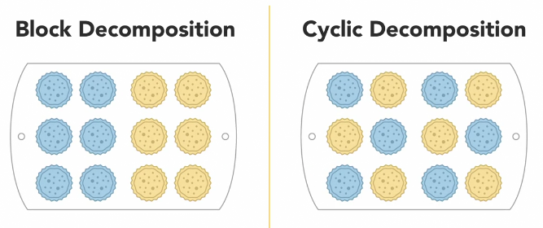

## Functional decomposition (Descomposición funcional):

Comienza considerando todo el problema como una sola función, y luego se divide en funciones más pequeñas.

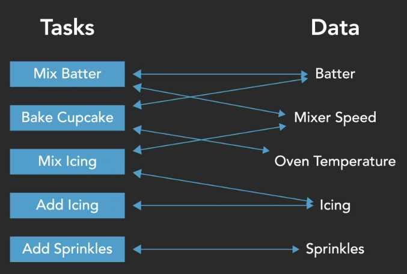

## Mixed:

Es natural combinar ambas técnicas.

# Communication:
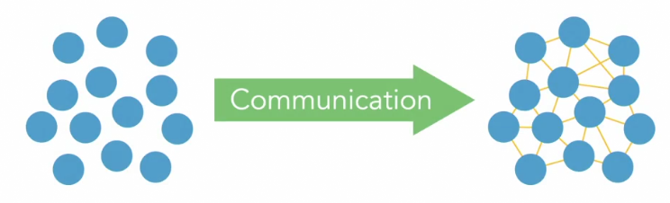

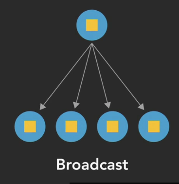
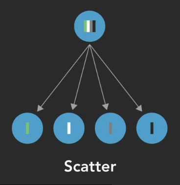
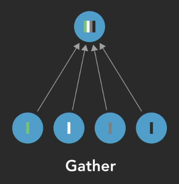

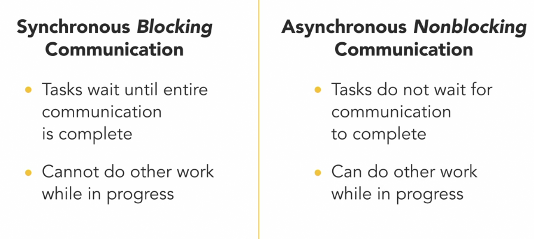

## Factores a considerar

- `Overhead`: Tiempo - recursos de cómputo que se gastan en comunicación.
- `Latency`: Tiempo que se tarda en enviar un mensaje.
- `Badwidth`: Cantidad de datos que se pueden enviar en un tiempo dado.

# Agglomeration:
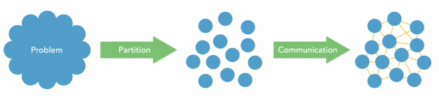

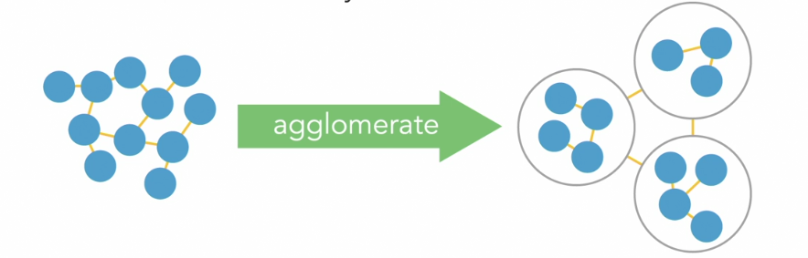

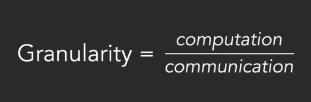

## Fine-grained Parallelism (Paralelismo de grano fino):

- Largo número de pequeñas tareas.
- **Ventaja:** Burns distribución de carga de trabajo.
- **Desventaja:** Bajo ratio de computación / comunicación.
  - 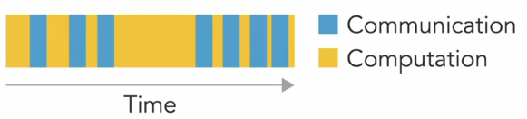

## Coarse-grained Parallelism (Paralelismo de grano grueso):

- Pequeño número de tareas grandes.
- **Ventaja:** Alto ratio de computación / comunicación.
- **Desventaja:** Puede causar desbalance de carga de trabajo.
  - 

>[!NOTE]
> A menudo se usa el medium-grained parallelism (Paralelismo de grano medio) para combinar las ventajas de ambos.

>[!CAUTION]
> Se debe de tener en cuenta la flexibilidad del programa, ya que si se dise;a para dos procesadores, no se podrá ejecutar en 4 procesadores y será necesario reescribir el programa.

# Mapping:

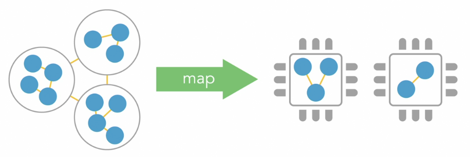

**No es aplicable para:**
- Sigle-core processors (Procesadores de un solo núcleo).
- Automated task scheduling (Programación de tareas automatizada).

# Resumen:

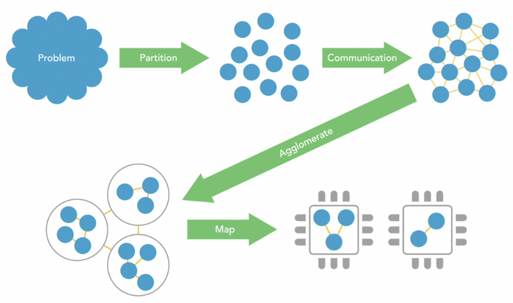

# Questions

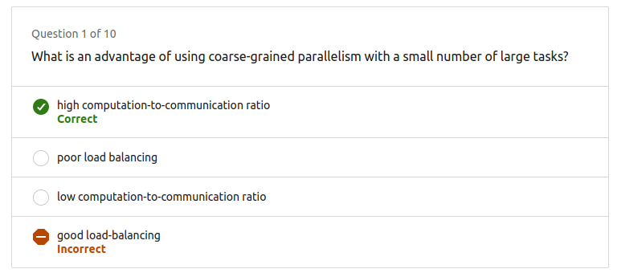

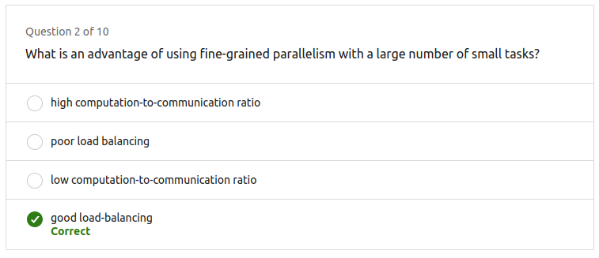

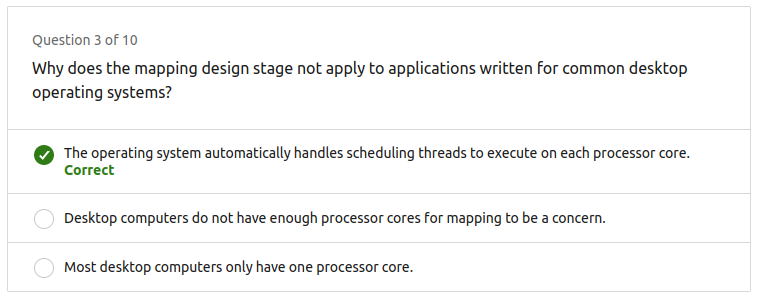

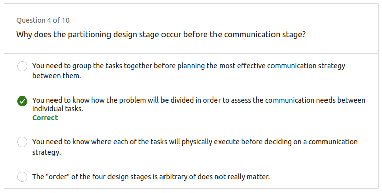

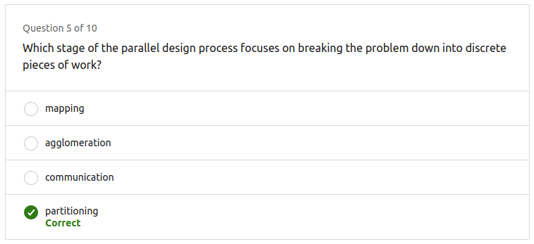

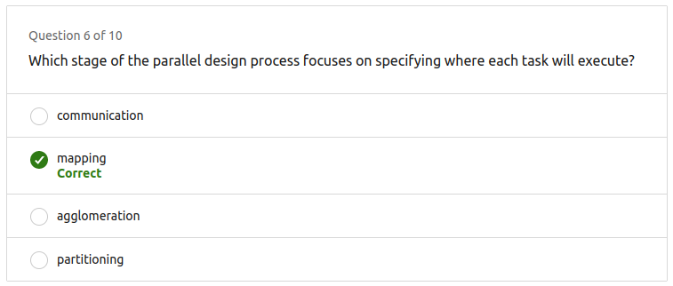

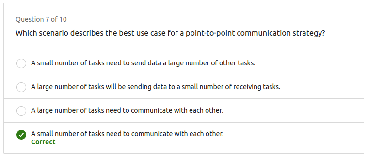

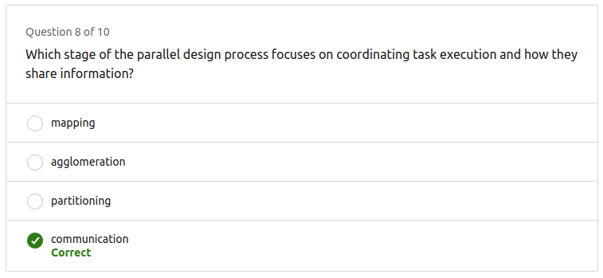

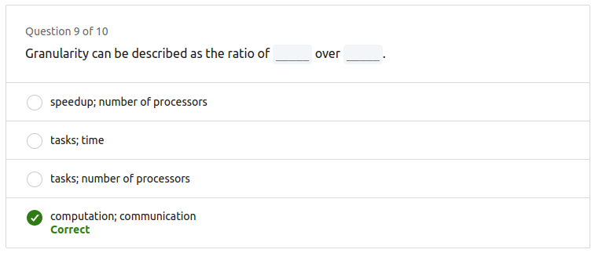

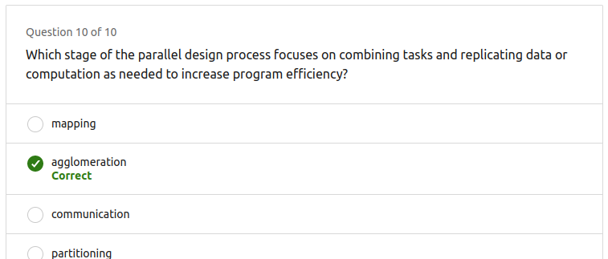